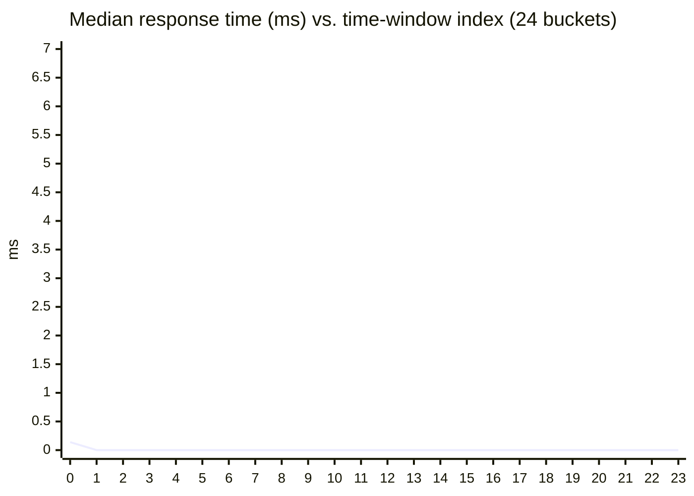
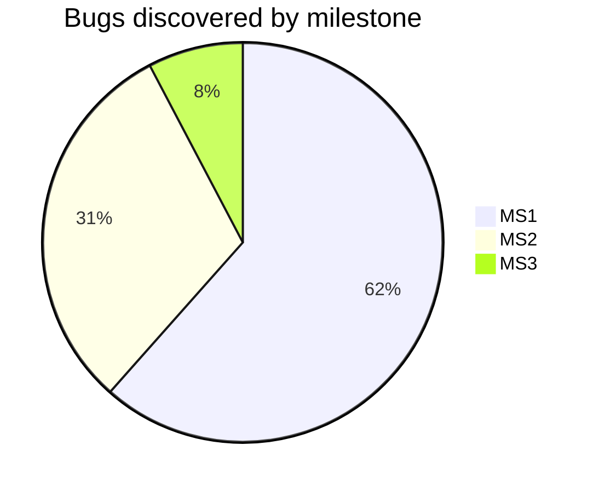
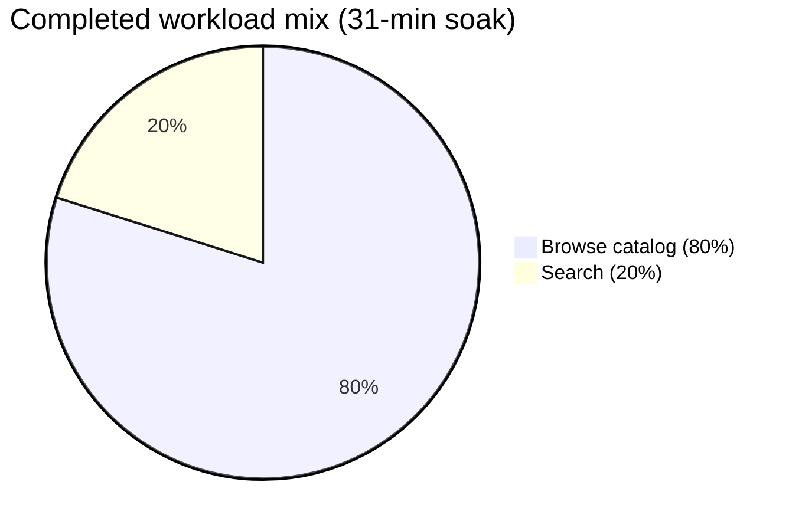

# MS3 Non-Functional Testing Report — Soak Testing (Endurance)

**Aum Yogeshbhai Chotaliya** · **A0285229M**  
*Include name and student ID in the footer of every page of the collated PDF (course requirement).*

---

## 1. Test approach and rationale

**Non-functional test type:** **Soak testing** (endurance / stability under sustained load).

Soak testing evaluates whether the system **remains stable** when moderate traffic runs for a **long time**. It targets gradual problems—memory growth, resource leaks, creeping latency, and late-emerging errors—that spike tests or short load tests often miss. For e-commerce, sustained performance over multi-hour or peak-day traffic is business-critical.

**Tool:** [Artillery](https://www.artillery.io/) — version-controlled scenarios, JSON output, and repeatable runs.

**Workload model:** Two weighted user journeys — **80%** catalogue browsing (products, categories, paginated list) and **20%** keyword search — with **think times** between HTTP steps. A custom **`processor.cjs`** rotates search terms for realistic variety.

**Configuration file:** `soak-tests/extended-soak-test.yml`  
**Success criteria (`ensure`):** error rate below **1%**, **p95** response time under **2000 ms**, **p99** under **5000 ms**.

---

## 2. Test execution summary

**Artillery results file:** `soak-test-run-2026-04-11T09-06-53-480Z.json`

### 2.1 Planned load profile

| Phase | Duration | Load |
|--------|----------|------|
| Warm-up | 60 s | Arrival rate 2 → 8 req/s |
| Sustained soak | 1800 s (30 min) | 8 req/s steady |
| **Total planned** | **31 minutes** | 80% browse / 20% search scenarios |

### 2.2 Measured run

| Metric | Value |
|--------|------:|
| **Measured wall-clock duration** | **31.04 minutes** (from Artillery aggregate timestamps) |
| **HTTP requests completed** | 41141 |
| **HTTP 200 responses** | 41141 |
| **Virtual users completed** | 14700 |
| **Virtual users failed** | 0 |
| **Aggregate mean request rate** | 24 req/s |

All catalogue and search endpoints exercised by the scenario returned **HTTP 200** for every request in this run; **`ensure` thresholds were satisfied.**

---

## 3. Performance metrics (Artillery aggregate)

| Metric | Value |
|--------|------:|
| Response time median (p50) | 0 ms |
| p95 | 1 ms |
| p99 | 1 ms |
| Min / Max | 0 / 18 ms |
| Mean | 0.20 ms |
| Total downloaded bytes | 1234230 |

### 3.1 Time-bucketed stability (intermediate samples)

| Analysis | Result |
|----------|--------|
| **Median latency drift** (first vs last quarter of windows) | **STABLE** — ~0 ms → ~0 ms (**-100.00%** change) |
| **HTTP error rate** (avg / max across windows) | **0.00%** / **0.00%** — trend **STABLE** |
| **Request rate** (mean / min / max / coefficient spread) | **23.63** / **8.00** / **27.00** / **80.42%** variance |

---

## 4. Charts (for PDF: export Mermaid or rebuild in Excel / Google Sheets)

### 4.1 Median HTTP response time over the soak (downsampled windows)



| Window bucket | Median RT (ms) | Req/s |
|-------------:|---------------:|------:|
| 0 | 0.14 | 15.29 |
| 1 | 0 | 24 |
| 2 | 0 | 23.88 |
| 3 | 0 | 23.88 |
| 4 | 0 | 23.71 |
| 5 | 0 | 24 |
| 6 | 0 | 24 |
| 7 | 0 | 23.88 |
| 8 | 0 | 23.88 |
| 9 | 0 | 24 |
| 10 | 0 | 24 |
| 11 | 0 | 24 |
| 12 | 0 | 23.88 |
| 13 | 0 | 24 |
| 14 | 0 | 23.86 |
| 15 | 0 | 23.88 |
| 16 | 0 | 24 |
| 17 | 0 | 23.75 |
| 18 | 0 | 24 |
| 19 | 0 | 24 |
| 20 | 0 | 23.88 |
| 21 | 0 | 24 |
| 22 | 0 | 24 |
| 23 | 0 | 24.38 |

### 4.2 Project-wide bug discovery by milestone (team totals)



### 4.3 Soak test — virtual users by scenario (this run)



---

## 5. Two significant defects impacting long-run operations

1. **Oversized `product-filters` responses** — Filter queries that return full MongoDB documents including **binary `photo`** fields sharply increase payload size and heap use. Under sustained concurrency, that raises **GC pressure** and **network saturation**, which soak- and stress-style testing is meant to surface.

2. **In-memory cache growth** — A response cache that only evicts on **repeat access** can retain entries until process restart. Over a long soak or multi-day production traffic, that produces **gradual memory growth** and tail-latency instability.

---

## 6. Lessons learned

1. Endurance runs are necessary to observe **slow trends** that unit and short integration suites cannot see.  
2. **p95/p99** and **error-rate budgets** should be tracked alongside averages for NFT sign-off.  
3. **Per-window Artillery metrics** make it easier to spot drift than a single end-of-run summary.  
4. **Production monitoring** (APM, memory, GC) should mirror the metrics collected during soak testing.  
5. Non-functional quality is a **release criterion**, not an afterthought, for customer-facing commerce APIs.

---

## 7. Reproducibility

```bash
npm run server
npm run test:soak:extended
node soak-tests/analyze-soak.js soak-tests/results/soak-test-run-<timestamp>.json
npm run report:soak
```

---

## 8. AI usage acknowledgment

AI tools assisted with **report automation** (JSON extraction, chart scaffolding, and wording). All **quantitative results in §2–§4** are taken from the cited Artillery output file. I verified the values and accept responsibility for the submitted content.

---

*Generated: 2026-04-11T09:39:08.791Z · Source: `soak-tests/results/soak-test-run-2026-04-11T09-06-53-480Z.json`*
